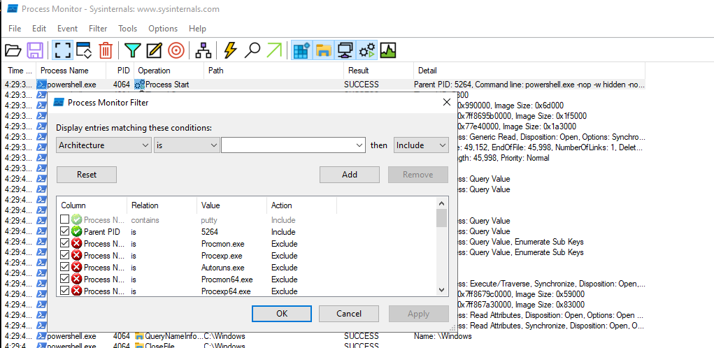

## Tools
Basic Static:
- File hashes
- VirusTotal
- FLOSS
- PEStudio
- PEView

Basic Dynamic Analysis
- Wireshark
- Inetsim
- Netcat
- TCPView
- Procmon

## Challenge Questions:

### Basic Static Analysis
---

- What is the SHA256 hash of the sample
- `0c82e654c09c8fd9fdf4899718efa37670974c9eec5a8fc18a167f93cea6ee83`
- What architecture is this binary? `32  bit`
- Are there any results from submitting the SHA256 hash to VirusTotal?? `Yes`
- Describe the results of pulling the strings from this binary. Record and describe any strings that are potentially interesting. Can any interesting information be extracted from the strings?
- Describe the results of inspecting the IAT for this binary. Are there any imports worth noting?
- Is it likely that this binary is packed?
---

### Basic Dynamic Analysis
 - Describe initial detonation. Are there any notable occurances at first detonation? Without internet simulation? With internet simulation?
   - Without internet 
     - A legitimate looking PuTTY window opens 
     - a powershell window opens and closes, then nothing else happens. 
   - With internet simulation 
     - Same behavior 
 - From the host-based indicators perspective, what is the main payload that is initiated at detonation? What tool can you use to identify this?
 - What is the DNS record that is queried at detonation? `bonus2.corporatebonusapplication.local`
 - What is the callback port number at detonation? `8443`
 - What is the callback protocol at detonation? `http`
 - How can you use host-based telemetry to identify the DNS record, port, and protocol? 
 - Attempt to get the binary to initiate a shell on the localhost. Does a shell spawn? What is needed for a shell to spawn? For a shell to spawn you would need a legitimate TLS certificate 

### **Steps taken to find powershell activity** 
- In `procmon` filtered by `Parent PID` of putty to find child processes. Discovered a long powershell one liner 
  
  
- In the `New-Object` command found a base64 string. Copied the string to the remnux vm for decoding. Found that it generates a `gzip` file. 

- Went to the generated file and extracted its contents to get the plain text payload: 
