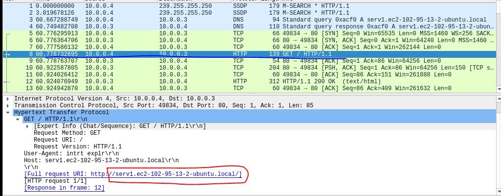
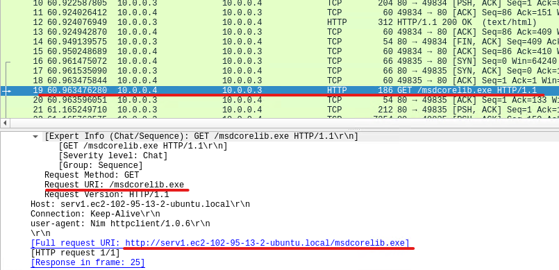
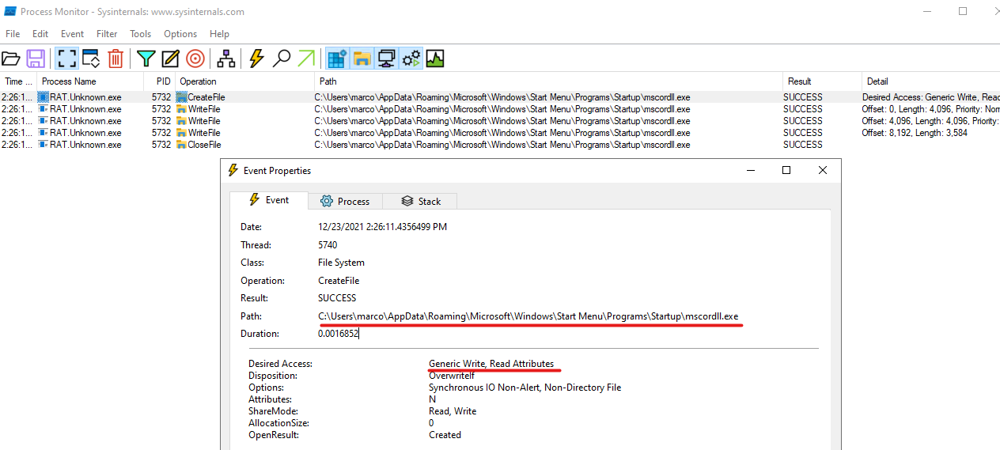
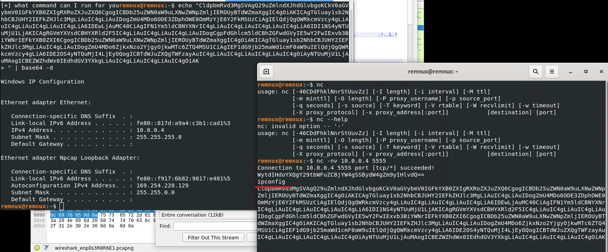

## Hashes 
- `md5` - 689FF2C6F94E31ABBA1DDEBF68BE810E
- `sha1` - 69B8ECF6B7CDE185DAED76D66100B6A31FD1A668
- `sha256` - 248D491F89A10EC3289EC4CA448B19384464329C442BAC395F680C4F3A345C8C

## Strings 
- Floss.exe output 
```
  - @SSL support is not available. Cannot connect over SSL. Compile with -d:ssl to enable.
  - @https
  - @No uri scheme supplied.
  - InternetOpenW
  - InternetOpenUrlW
  - @wininet
  - @wininet
  - MultiByteToWideChar
  - @kernel32 
  - @kernel32
  - MessageBoxW
  - @user32
  - @user32
  - @[+] what command can I run for you
  - @[+] online
  - @NO SOUP FOR YOU
  - @\mscordll.exe
  - @Nim httpclient/1.0.6
  - @/msdcorelib.exe
  - @AppData\Roaming\Microsoft\Windows\Start Menu\Programs\Startup
  - @intrt explr
  - @http://serv1.ec2-102-95-13-2-ubuntu.local

```
<br> 

## Network Indicators  


- GET request for `msdcorelib.exe` to `serv1.ec2-102-95-13.2-ubuntu.local` 

<br> 

## Host Indicators 
- Running procmon to find host indicators filtering using `Process Name == RAT.Unknown.exe` and `Operation contains File`
- Looking for PATH found in strings - `AppData\Roaming\Microsoft\Windows\Start Menu\Programs\Startup`



- Looks like it is writing a file called `mscordll.exe` 
- GET request was for `msdcorelib.exe`
  - Having a `dll` being called an `.exe` is suspicious 
  - Written into startup directory might be a way of achieving persistence by making this run on startup
- Found the `mscordll.exe` file in the suspected path 


<br> 

- **TCP artifacts** using TCPView
  - TCP socket in listening state on port `5555`
  

  - Using `netcat` from a remnux VM to establish a connection and gather more information
  

  - Confirmed command injection capabilities. Injects commands and returns base64 encoded information  
  

  - Looks like this is a `bind shell`
    - Anyone that connects on port `5555` can issue a command and output is returned to us 