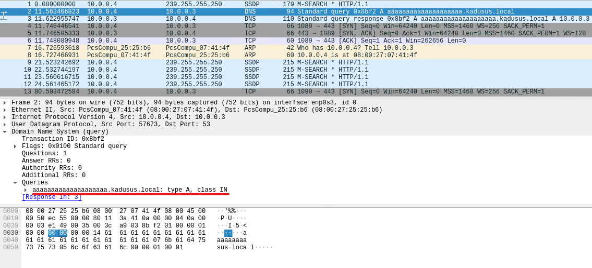
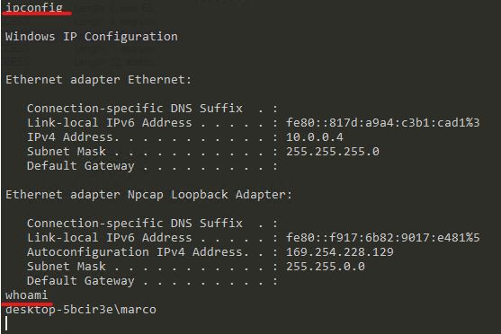

## Hashes 
- `c211704777e168a5151de79dc87ffac7  RAT.Unknown2.exe.malz`
- `c522e0f1f9edb7e03c0a770e4c52a93db72dce21e7247322f4bbd5b053b967aab5240ce90d6aa65a79e3a3068f227346bf0190f9ca762fb8e8d076a58490d7a1  RAT.Unknown2.exe.malz`   

 

## Dynamic Analysis 
- A Record DNS query: `aaaaa...kadusus.local`

- Redirect DNS query by adding `127.0.0.1 aaa...kadusus.local` on the `host file` 
- Potential call out to DNS record on `https` port (443)

- Use `procmon` to get TCP operations information 
  
- Use `netcat` to establish a listener and establish connection 
  
- Ran commands and saw a `cmd.exe` flash on the host and then received output back 
  

- This gives us `reverse shell` capabilities

- Using `procmon` process tree - found the child processes spawned by the main `RAT.Unknown2.exe` 
  
